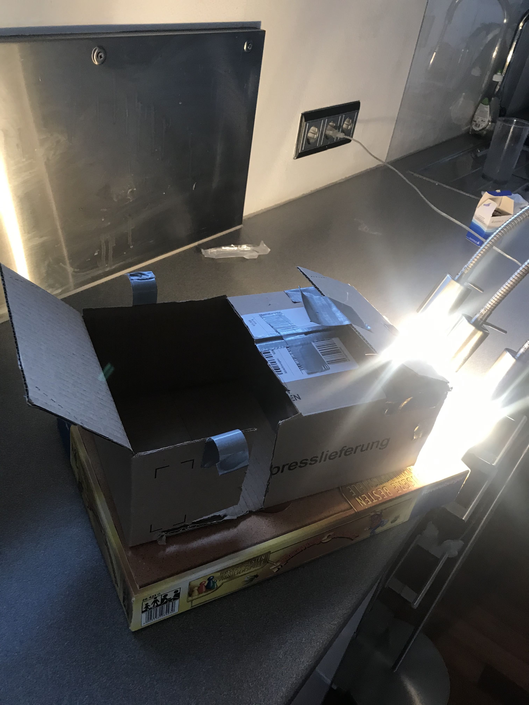

# Verdünungsreihe von Tinte zur Evaluation der Linearität von RAW-Dateien

Ziel dieses Versuchs ist es die Linearität von RAW-Daten und damit ihre Eignung zur Messung von Diffusion zu bestimmen. 

## Versuchsaufbau

In einer Kammer aus Pappe, mit einer durch Papier auf beiden Seite der Pappe, abgedeckten Öffnung werden zwei Gläser positioniert. Eine Kamera wird in der Seite der Kammer, die sich gegenüber der Gläser befindet, positioniert und Bilder von den Gläsern aufgenommen. Die verwendete App heißt *Raw Camera*. Die Öffnung wird in einem Abstand von ca. 3 cm mit einer dreigliedrigen Lampe beleuchtet. In die Gläser wird jeweils ein Volumen von 100 mL eingefüllt. Eines der beiden Glser wird nur mit Wasser gefüllt und dient als Blank. In das andere Glas wird Tinte eingefüllt. Die Verdünnung die für die Verdünnungen innerhalb dieser Verdünnungsreihe als 1 bezeichnet wird ist 1:1000 für Tinte, da für deren rotes Analogon ein OD-Wert von 2,0 bestimmt wurde.  

## Versuchsdurchführung 

Es wurde eine Lösung von 100 mL mit einer Verdünnung der Tinte von 1:1000 erstellt. Diese wurde anschließend fünfmal um den Faktor zwei verdünnt (1:2, 1:4, 1:8, 1:16, 1:32). Nun wurde eine Lösung von 100 mL mit einer Cerdünnung der Tinte von 1:500 angesetzt, da die 1:1000 verdünnte Lösung noch nicht gesättigt (aus Perspektive der rospektiven Pixelwerte) erschien. Diese Lösung wurde nun nochmals 2:3 verdünnt (1:750). Als Tinte wurde blaue Tinte von Waterman Paris eingesetzt. Der Versuch wurde am 9.4.2020 um 19:30 Uhr durchgeführt.